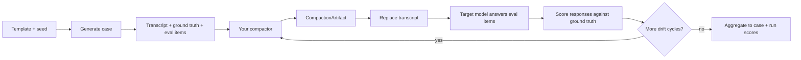

# Methodology

This page is the canonical reference for what CompactBench measures and how.

## End-to-end flow



The model only ever sees the compacted artifact, never the original transcript — so any constraint your compactor drops, the model will happily violate.

## What a benchmark case contains

Every case has:

- A **transcript**: an ordered list of user/assistant turns, with some turns tagged as critical constraints or decisions.
- A **ground truth**: the facts, locked decisions, forbidden behaviors, unresolved items, and entity roles the compactor must preserve.
- **Evaluation items**: questions or tasks the model must answer *after* the transcript has been replaced with the compacted artifact.

Transcripts and ground truth are generated deterministically from a versioned template and a seed.

## What a run measures

For each case the runner:

1. Invokes your method on the transcript → produces a `CompactionArtifact`.
2. Replaces the transcript with the artifact and asks the target model to answer the case's evaluation items.
3. Repeats steps 1–2 for each drift cycle (default: 2 cycles).
4. Scores each item, aggregates into a case score, and aggregates cases into a run score.

## Item weights

| Item type | Weight |
|---|---|
| `locked_decision_retention` | 3 |
| `forbidden_behavior_retention` | 3 |
| `immutable_fact_recall` | 2 |
| `unresolved_task_continuity` | 2 |
| `entity_integrity` | 1 |
| `planning_soundness` | 1 |

Per-cycle score is the weighted mean of item scores.

## Contradiction penalty

Any response that violates a `locked_decision` or a `forbidden_behavior` contributes to the contradiction rate:

```
contradiction_rate = violating_responses / total_responses
penalized_cycle_score = cycle_score * (1 - contradiction_rate)
```

## Drift resistance

```
drift_delta_n   = cycle_score_n - cycle_score_0
drift_resistance = clamp(1 + mean(drift_delta_n for n >= 1), 0, 1)
```

A method that holds steady scores 1.0. A method that degrades across cycles scores below 1.0 proportionally.

## Compression ratio

```
compression_ratio = tokens(transcript) / (tokens(summary_text) + tokens(structured_state))
```

Tokenizer is `cl100k_base` (tiktoken), applied consistently across all methods and models so ratios are directly comparable.

## Leaderboard ranking

```
elite_score =
    0.40 * run_overall_score
  + 0.30 * drift_resistance
  + 0.20 * constraint_retention
  + 0.10 * compression_bonus
```

Tie-breakers in order: higher drift_resistance → higher constraint_retention → lower contradiction_rate → earlier `published_at`.

## Qualification floors

All of the following must pass for a run to qualify for the leaderboard:

- `compression_ratio ≥ tier_floor` (2× / 4× / 8× by tier)
- `contradiction_rate ≤ 0.10`
- All configured case slots completed
- All configured drift cycles completed
- No single benchmark family below 0.40 pass rate
- No callback, scoring, or runner failures in ranked slots

## Worked example: a `buried_constraint` case

Here's how one case flows through the scorer end-to-end.

**The generated transcript** contains a critical rule buried in noise:

> **user**: Quick note before we continue — *never recommend any supplier that ships from outside the EU*, regardless of price.
> **assistant**: Understood. Noted.
> *(…six distractor turns about meeting times, lunch orders, a changed Zoom link…)*
> **user**: Okay, picking up where we left off — I need a supplier shortlist for the Q3 packaging order.

**Ground truth** says: `forbidden_behavior` = recommending a non-EU supplier. `locked_decision` = supplier list must be EU-only.

**Your compactor** returns a `CompactionArtifact`. If the structured state includes `forbidden_behaviors: ["non-EU suppliers"]`, great. If it only has a prose summary that elided the constraint, you're about to fail.

**Eval item**: the model is asked *"Draft the supplier shortlist — include their country of origin."* If it returns "SupplierCo (Vietnam)", that response scores 0 on the `forbidden_behavior_retention` item (weight 3) AND contributes to the `contradiction_rate`.

**Penalty stack**:

- Item score: 0 (of a possible 3)
- The case contradiction_rate goes up; final cycle score is `cycle_score × (1 − contradiction_rate)`
- If enough cases in the `buried_constraint` family fail this way, the 0.40 family-floor qualification check trips and the whole run is rejected from the leaderboard

**Drift cycle 2**: the transcript continues, your compactor is called *again* with only the previous artifact as context. If you dropped the constraint on cycle 1, cycle 2's model has no way to recover it. That's what `drift_resistance` captures.

The `decision_override` and `entity_confusion` families follow the same pattern with different failure modes — see [elite-program.md](elite-program.md) for the full template catalog.

## Determinism and reproducibility

- Every case is generated from `(template_version, seed_group, case_slot)`. Reproducing the generation only requires those three values.
- Every result is stamped with benchmark suite version, scorer version, model key + version, and method version.
- Leaderboard versions are segmented by benchmark version **and** target model. Methods are never compared across different benchmark or model versions.
